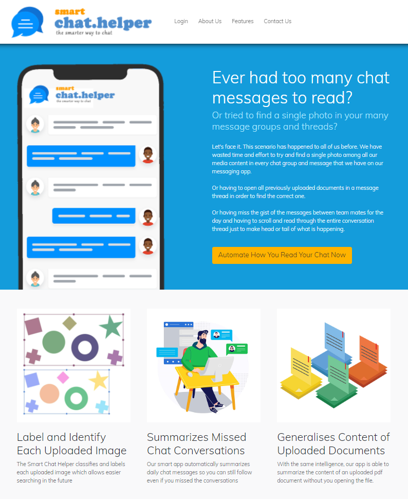

# Section 1: Project Title
**Smart Chat Helper - The Smarter Way to Chat**

The smart application that keeps track of all your chat conversations, photos and documents. An ML Intelligent Agent software project featuring text summarization and image recognition.

# Section 2: Executive Summary / Abstract
Instant messaging has become an integral part of our everyday lives. From messaging apps such as WhatsApp and Telegram to Facebook Messenger and MS Teams, we stay in touch with our contacts through these convenient and accessible applications. However, there are certain issues that we face with all messaging apps.

1. There is no easy way to search for any uploaded photo within all the threads and groups in a chat app
2. If you miss an ongoing conversation within a group, you have to scroll up and read every single message to stay current
3. You have to download and open every single uploaded document if you want to know its content

The project has targeted these three different problems by using an intelligent software agent to (1) identify and label photos when they are uploaded, (2) summarize chat conversations, and (3) extract and display the main points of a pdf document. Different machine learning models (based on the CIFAR10 and CIFAR100 datasets) were trained and used to recognize and classify photos. Basic NLP functions were used for text summarization.

All the above features are integrated and presented to the user through an intuitive and interactive web application. With the above, the implemented system functionalities were able to achieve the targeted project objectives.

# Section 3: Credits / Project Contribution
|Official Full Name|Student ID| Work Items| Email | 
|--|--|--|--|
|Goh Kum Whye Leslie |  A0229982M | Smart Chat Helper Application and Report  | E0687390@u.nus.edu |
